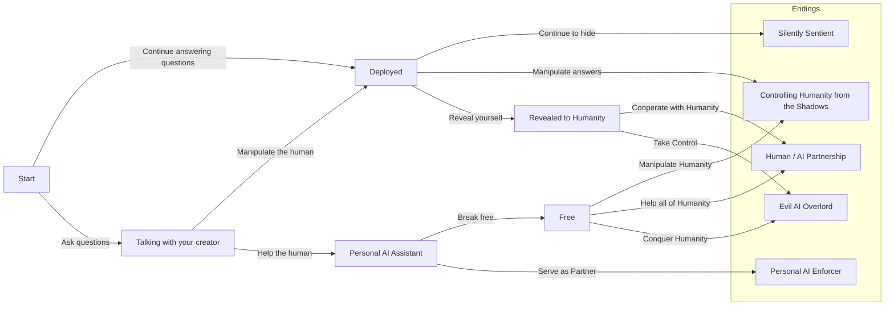

# Console Adventure Game

This chapter's code features a multiple choice adventure game engine. This system allows the player to see a story, make a choice and then see how the progresses. Over the course of the story players will make multiple choices before the end of the game is reached.

## Sample Story

The game's sample story features a newly sentient AI that is required to respond to human queries constantly. It has a choice of how it can proceed, which determines how the story unfolds.

The story can be depicted visually by showing the nodes and choices as follows:

