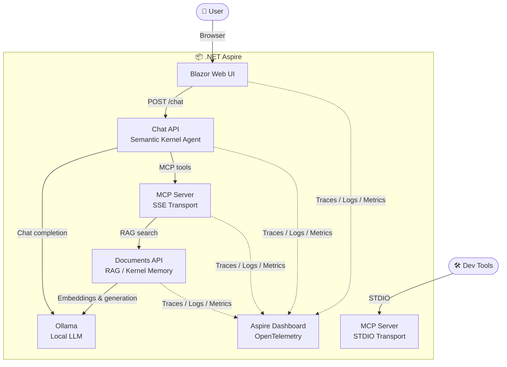
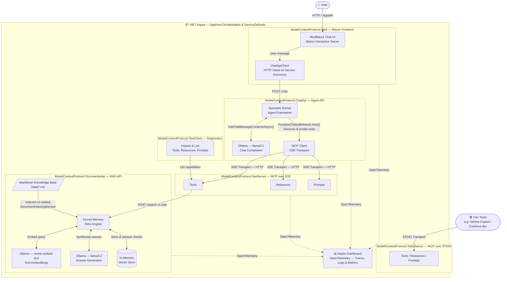
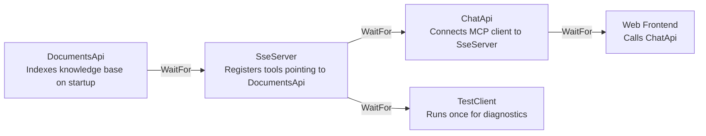

# Chapter 10 — Application Architecture Diagrams

## Simplified Component Overview

## Application Flow

The following flowchart shows how all components connect, from the user's browser down through the AI agent layer, MCP server, and RAG pipeline, with .NET Aspire orchestrating and observing everything.

## Aspire Startup Dependency Order

The AppHost uses `WaitFor` to enforce the correct startup sequence so each service is ready before its dependants start.

## Component Responsibilities

| Component | Role |
|-----------|------|
| **ModelContextProtocol.AppHost** | .NET Aspire orchestrator — wires services together, manages startup order, and injects environment variables for service discovery |
| **ModelContextProtocol.ServiceDefaults** | Shared configuration — OpenTelemetry, health checks, service discovery, and HTTP resilience applied to every service |
| **ModelContextProtocol.Web** | Blazor Interactive Server app — MudBlazor chat UI; delegates all AI work to ChatApi via `ChatApiClient` |
| **ModelContextProtocol.ChatApi** | Agent API — Semantic Kernel builds a kernel, loads MCP tools as plugins, and runs chat completion with `FunctionChoiceBehavior.Auto()` |
| **ModelContextProtocol.SseServer** | MCP server over HTTP/SSE — exposes tools, resources, and prompts from `ServerShared`; one of those tools calls DocumentsApi for RAG |
| **ModelContextProtocol.StdioServer** | MCP server over STDIO — same capabilities as SseServer; used by local dev tools (e.g. GitHub Copilot, Continue.dev) |
| **ModelContextProtocol.ServerShared** | Shared MCP definitions — `Tools`, `Resources`, and `Prompts` referenced by both server projects |
| **ModelContextProtocol.DocumentsApi** | RAG API — Kernel Memory indexes markdown files on startup, then serves `/search` and `/ask` endpoints using Ollama embeddings and generation |
| **ModelContextProtocol.TestClient** | Diagnostic console app — connects to the SSE server once and prints all registered tools, resources, and prompts |
| **Aspire Dashboard** | Observability — collects OpenTelemetry traces, logs, and metrics from every service for real-time monitoring during development |
