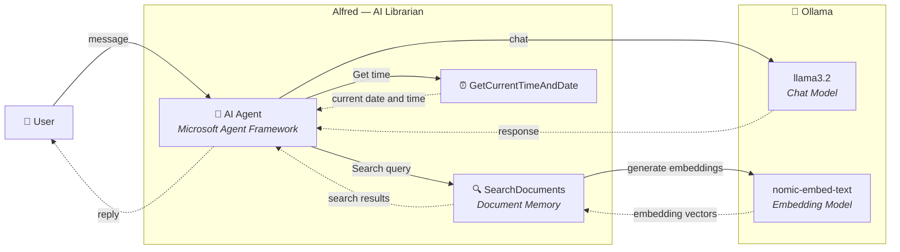
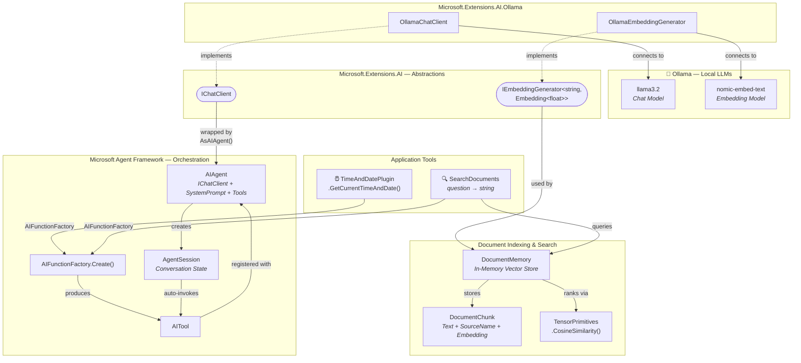
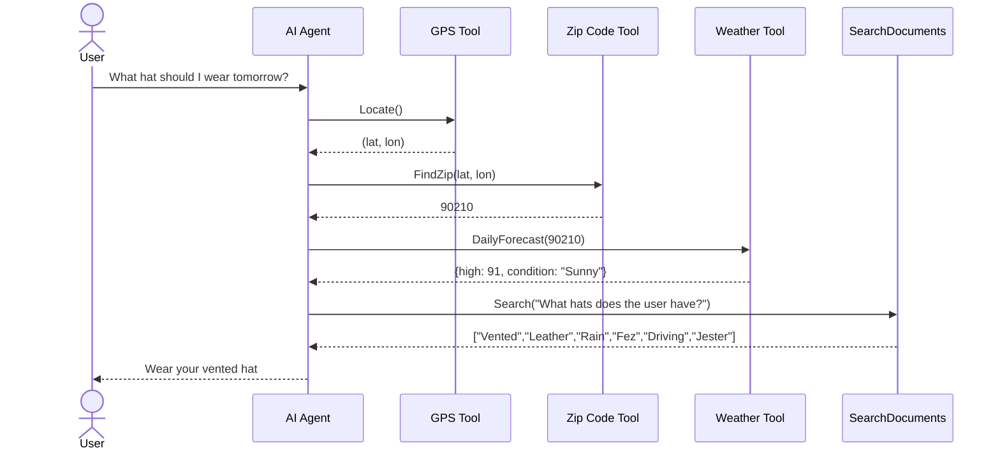

# Chapter 9 — Architecture Diagrams

## Application Architecture (Simplified)

```mermaid
flowchart LR
    User["👤 User"] -- message --> Agent

    subgraph App["Alfred — AI Librarian"]
        Agent["🤖 AI Agent<br/><i>Microsoft Agent Framework</i>"]
        SearchTool["🔍 SearchDocuments<br/><i>Document Memory</i>"]
        TimeTool["⏰ GetCurrentTimeAndDate"]
    end

    subgraph Ollama["🦙 Ollama"]
        ChatModel["llama3.2<br/><i>Chat Model</i>"]
        EmbedModel["nomic-embed-text<br/><i>Embedding Model</i>"]
    end

    Agent -- "Search query" --> SearchTool
    SearchTool -. "search results" .-> Agent

    Agent -- "Get time" --> TimeTool
    TimeTool -. "current date and time" .-> Agent

    Agent -- "chat" --> ChatModel
    ChatModel -. "response" .-> Agent

    SearchTool -- "generate embeddings" --> EmbedModel
    EmbedModel -. "embedding vectors" .-> SearchTool

    Agent -. reply .-> User
```

## Application Architecture (Detailed)

```mermaid
flowchart TD
    subgraph Ollama["🦙 Ollama — Local LLMs"]
        LLM["llama3.2<br/><i>Chat Model</i>"]
        EMB["nomic-embed-text<br/><i>Embedding Model</i>"]
    end

    subgraph MEAI["Microsoft.Extensions.AI — Abstractions"]
        IChatClient(["IChatClient"])
        IEmbedGen(["IEmbeddingGenerator&lt;string,<br/>Embedding&lt;float&gt;&gt;"])
    end

    subgraph OllamaPkg["Microsoft.Extensions.AI.Ollama"]
        OCC["OllamaChatClient"]
        OEG["OllamaEmbeddingGenerator"]
    end

    subgraph AgentFW["Microsoft Agent Framework — Orchestration"]
        AIAgent["AIAgent<br/><i>IChatClient + SystemPrompt + Tools</i>"]
        Session["AgentSession<br/><i>Conversation State</i>"]
        Factory["AIFunctionFactory.Create()"]
        AITool["AITool"]
    end

    subgraph VectorSearch["Document Indexing &amp; Search"]
        DocMem["DocumentMemory<br/><i>In-Memory Vector Store</i>"]
        Chunk["DocumentChunk<br/><i>Text + SourceName + Embedding</i>"]
        Cosine["TensorPrimitives<br/>.CosineSimilarity()"]
    end

    subgraph AppTools["Application Tools"]
        TimeTool["⏰ TimeAndDatePlugin<br/>.GetCurrentTimeAndDate()"]
        SearchTool["🔍 SearchDocuments<br/><i>question → string</i>"]
    end

    %% Ollama ↔ Implementations
    OCC -- "connects to" --> LLM
    OEG -- "connects to" --> EMB

    %% Implementations → Abstractions
    OCC -. "implements" .-> IChatClient
    OEG -. "implements" .-> IEmbedGen

    %% Agent Framework wiring
    IChatClient -- "wrapped by<br/>AsAIAgent()" --> AIAgent
    AIAgent -- "creates" --> Session
    Factory -- "produces" --> AITool
    AITool -- "registered with" --> AIAgent
    Session -- "auto-invokes" --> AITool

    %% Tool creation
    TimeTool -- "AIFunctionFactory" --> Factory
    SearchTool -- "AIFunctionFactory" --> Factory

    %% Document search internals
    IEmbedGen -- "used by" --> DocMem
    DocMem -- "stores" --> Chunk
    DocMem -- "ranks via" --> Cosine

    %% Search tool → DocumentMemory
    SearchTool -- "queries" --> DocMem
```

## AI Orchestration Example — Multi-Tool Sequence

```mermaid
sequenceDiagram
    actor User
    participant Agent as AI Agent
    participant GPS as GPS Tool
    participant Zip as Zip Code Tool
    participant Weather as Weather Tool
    participant Search as SearchDocuments

    User->>Agent: What hat should I wear tomorrow?
    Agent->>GPS: Locate()
    GPS-->>Agent: (lat, lon)
    Agent->>Zip: FindZip(lat, lon)
    Zip-->>Agent: 90210
    Agent->>Weather: DailyForecast(90210)
    Weather-->>Agent: {high: 91, condition: "Sunny"}
    Agent->>Search: Search("What hats does the user have?")
    Search-->>Agent: ["Vented","Leather","Rain","Fez","Driving","Jester"]
    Agent-->>User: Wear your vented hat
```
